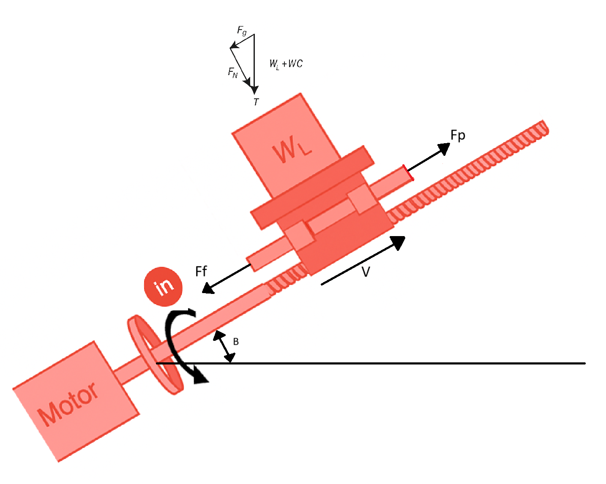

# CLASE 2 III CORTE
# Sistemas de Transmisión 

## Tornillo Sin Fin

El objetivo de un tornillo sin fin es convertir **movimiento rotacional** (usualmente generado por un motor) en **movimiento lineal**. Existen diferentes tipos de dientes y geometrías en estos tornillos, siendo dos los más comunes:

### Tipos de Dientes en Tornillos Sin Fin

- **Dientes Cuadrados**:  
  - Permiten realizar movimientos de menor escala.
  - Son menos robustos a nivel estructural, ya que las cargas tienden a concentrarse en un punto, lo que puede causar flexión.

- **Dientes Trapezoidales** (usualmente con ángulo de 29° o 30°):  
  - Permiten mover cargas mucho más altas.
  - La cápsula se acopla mejor y las fuerzas se distribuyen de manera más uniforme a lo largo de todos los dientes, lo que mejora la resistencia y la capacidad de carga.
 

### Tipos de Cápsulas en Tornillos Sin Fin

- **Tornillo ACME**:  
  - La cápsula es una tuerca con rosca interna que se desplaza a lo largo de la trayectoria helicoidal del tornillo.
  - Permiten transmitir grandes potencias.
  - La eficiencia de los tornillos ACME está entre el 35% y el 85%.

- **Cápsula con Esferas Recirculantes (Ball Screw)**:  
  - Incorpora esferas dentro de la cápsula para reducir la fricción y mejorar la distribución de las fuerzas.
  - Permiten transmitir grandes potencias.
  - Actúan como rodamientos, lo que permite reducir el backlash (juego mecánico) y la fricción.
  - Tienen eficiencias que oscilan entre el 85% y el 95%.
  - Este mecanismo convierte el torque del motor en fuerza sobre la carga.

### Características Importantes para la Selección

- **Cabeceo (Pitch)**: Número de revoluciones necesarias para que la cápsula se desplace una distancia determinada (por ejemplo, 1 metro o 1 pulgada en sistema inglés).
- **Paso (Lead)**: Distancia que se desplaza la cápsula con una revolución del tornillo (en metros o pulgadas, según el sistema).

### Relación de transmisión

$$
\Delta \theta = 2 \pi p \Delta x
$$

$$
\frac{\Delta \theta}{\Delta x} = 2 \pi p
$$

$$
\frac{\Delta \theta / \Delta t}{\Delta x / \Delta t} = \frac{\text{Velocidad motor}}{\text{Velocidad carga}} = \frac{\dot{\theta}}{\dot{x}} = 2 \pi p
$$

### Simulación en Simulink

### Inercia Reflejada

Se calcula a partir de la energía cinética de la carga en movimiento. Dado que el movimiento es lineal, existe una velocidad asociada. En el caso del tornillo, la **inercia reflejada es despreciable**, ya que está conectado directamente al motor y no hay una transformación adicional debido al mecanismo.

**Energía Cinética:**

$$
KE = \frac{1}{2} m \dot{x}^2
$$

**Relación de transmisión:**

$$
\frac{\dot{\theta}}{\dot{x}} = 2 \pi p
$$

**Energía Cinética (velocidad angular):**

$$
KE = \frac{1}{2} \frac{m}{(2 \pi p)^2} \dot{\theta}^2
$$

**Inercia Reflejada:**

$$
J_{ref} = \frac{m}{(2 \pi p)^2}
$$

o también:

$$
J_{ref} = \frac{m}{N_s^2}
$$

#### Inercia total

**Masa total:**

$$
m=\frac{W_L+W_C}{g}
$$

**Inercia reflejada del sistema (tornillo, carga y carro):**

$$
J_{ref}^{trans}=J_{screw}+J_{load\rightarrow in}+J_{carriage\rightarrow in}
$$

Donde:

$$
J_{ref}^{trans}=J_{screw}+\frac{1}{\eta N_S^2}\left(\frac{W_L+W_C}{g}\right)
$$

### Torque de carga

El torque reflejado depende de la fuerza ejercida sobre la cápsula o carro.

**Fuerzas aplicadas en el sistema:**

$$
F_{ext}=F_f+F_g+F_p
$$

Donde:

$$
F_f=\mu(W_L+W_C)\cos\beta
$$

$$
F_g=(W_L+W_C)\sin\beta
$$

$$
F_{ext}=F_p+(W_L+W_C)(\sin\beta+\mu\cos\beta)
$$

**Consideraciones de la fuerza gravitacional:**

Cuando la carga se encuentra en una posición horizontal, el término de la fuerza gravitacional es igual a cero.

**Cálculo del torque reflejado en el motor:**

Para determinar el torque reflejado en el motor, se considera el trabajo realizado por la fuerza externa:

$$
Work=F_{ext}\frac{1}{(2\pi p)}\Delta\theta
$$

También se puede expresar como:

$$
Work=F_{ext}\Delta x
$$

**Torque reflejado en el sistema:**

El torque reflejado en el motor es:

$$
T_{load \rightarrow in}=F_{ext}\frac{1}{N_S}
$$

Tomando en cuenta la eficiencia del sistema, el torque reflejado final es:

$$
T_{load \rightarrow in}=\frac{F_{ext}}{\eta N_S}
$$

### Ejemplo

- Una carga de 50 kg debe ser posicionada usando un tornillo esferado de acero con 0.14 kg/cm³ de densidad, 0.182 cm de diámetro, 36 cm de longitud, 0.75 cm/rev de paso y 90% de eficiencia. El carro pesa 0.23 kg.  
  Calcule la inercia reflejada por la transmisión hacia su eje de entrada.

La inercia reflejada sería:

$J_{ref}^{trans} = J_{screw} + J_{load-in} + J_{carriage-in}$

$= J_{screw} + \frac{1}{\eta N_s^2}\left(\frac{W_L + W_C}{g}\right)$

Donde:

$N_s = 2\pi p$

$= 2\pi \cdot \frac{1}{0.75} = 8.38$

Se calcula suponiendo que el tornillo es un cilindro alargado:

$J_{ref}^{trans} = J_{screw} + \frac{1}{\eta N_s^2}\left(\frac{W_L + W_C}{g}\right)$

Por lo tanto:

$J_{ref}^{trans} = 5.42 \times 10^{-8} + \frac{1}{0.9 \cdot 8.38^2}\left(\frac{50 + 0.23}{9.89}\right) = 8.1 \, \text{Kgm}$

Para el tornillo:

$J_{screw} = \frac{\pi L \rho D^4}{32g}$

Cuando se trabaja en sistema inglés:

$J_{screw} = \frac{\pi \cdot 0.36 \cdot 140000 \cdot 0.00182^4}{32} = 5.42 \times 10^{-8} \, \text{Kgm}$

### Simulación simscpae multibody

  

---

## Piñón-Cremallera

Convierte **movimiento rotacional** en **movimiento lineal** mediante el acoplamiento de:
- Un **piñón** (rueda dentada).
- Una **cremallera** (barra dentada).

La velocidad tangencial del piñón se transmite a la cremallera, generando movimiento lineal. Este sistema es ampliamente usado en la industria debido a su facilidad de diseño, montaje sencillo y capacidad para obtener relaciones de transmisión altas en espacios reducidos.

### Relación de Transmisión

Se obtiene al comparar la velocidad del motor con la velocidad de la carga.  

$N=\frac{Velocidad\ motor}{Velocidad\ carga}$

$V_{rack}=r_{pinion}\omega_{pinion}$

$N_{RP}=\frac{1}{r_{pinion}}$

### Simulación en Simulink
  

### Inercia Reflejada

Se calcula según la masa y la configuración del sistema.

$J_{ref}^{trans}=J_{pinion}+J_{load\rightarrow in}+J_{carriage\rightarrow in}$

$=J_{pinion}+\frac{1}{\eta N_{RP}^2}\left(\frac{W_L+W_C}{g}\right)$

### Torque de Carga

Depende de la fuerza necesaria para mover la carga.  

$F_{ext}=F_f+F_g+F_p$

$T_{load\rightarrow in}=\frac{F_{ext}}{\eta N_{RP}}$

### Simulación en Simscape Multibody

---

## Banda Transportadora

Sistema que convierte una **entrada rotacional** en **movimiento lineal**. Puede tener más de dos poleas para transmitir el movimiento mediante una banda.

### Relación de Transmisión

Depende del tamaño de las poleas y la configuración del sistema.

$N=\frac{Velocidad\ motor}{Velocidad\ carga}$

$V_{belt}=r_{ip}\omega_{ip}$

$N_{BD}=\frac{1}{r_{ip}}$

### Inercia Reflejada

Se calcula en función de la masa en movimiento y las características de la banda y las poleas.

$J_{ref}^{trans}=J_{IP}+J_{load\rightarrow in}+J_{carriage\rightarrow in}+J_{belt\rightarrow in}+J_{LP}$

$=2J_p+\frac{1}{\eta N_{BD}^2}\left(\frac{W_L+W_C+W_{belt}}{g}\right)$

$J_{IP}=J_{LP}=J_p$

### Torque de Carga

Se determina según la fuerza requerida para desplazar la carga a lo largo de la banda.

$T_{load\rightarrow in}=\frac{F_{ext}}{\eta N_{BD}}$

## 

## Bandas con Más de Dos Rodillos

### Relación de Transmisión

pasame esto a formato markdown para github con $ sin espacios entre ecuaciones

### Inercia Reflejada

$J_{ID\rightarrow in}=\frac{J_{ID}}{\eta \left( \frac{r_{ID}}{r_{DR}} \right)^2}$

$J^{trans}_{ref}=J_{DR}+J_{load \rightarrow in}+J_{belt \rightarrow in}+J_{ID \rightarrow in}+J_{BR \rightarrow in}$

$=J_{DR}+\frac{1}{\eta N^2_{CV}}\left( \frac{W_L+W_{belt}}{g} \right)+\frac{J_{ID}}{\eta \left( \frac{r_{ID}}{r_{DR}} \right)^2}+\frac{J_{BR}}{\eta \left( \frac{r_{BR}}{r_{DR}} \right)^2}$

### Torque de Carga

$T_{load \rightarrow in}=\frac{F_{ext}}{\eta N_{CV}}$

$F_{ext}=F_p+(W_L+W_{belt})(\sin{\beta}+\mu \cos{\beta})$

Aplicando caso general donde la banda tiene un ángulo.

